---
layout: article
title: "Interests"
date: 2018-09-13 16:02:30 Z
author: ISL
categories: research
excerpt: 
image:
   teaser: interests.jpg
   path: interests.jpg
comments: true
locale: "en"
share: true
ads: true
--- 



## Visual odometry and SLAM
**SLAM(Simultaneous Localization and Mapping)** : 로봇이 자신의 **위치와 주변 지도를 동시에 추정**하는 기법으로, GPS를 사용할 수 없는 환경에서도 동작이 가능하다는 장점이 있다. SLAM은 추적 및 매칭에서 발생하는 오차가 성능에 큰 영향을 미친다. 이러한 문제를 해결하기 위해 **RAFSet SLAM**을 제안하였다.

	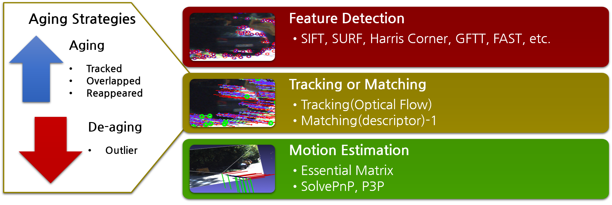 
    Fig1-1. Concept of RAF(Robust Aged Feature) 

	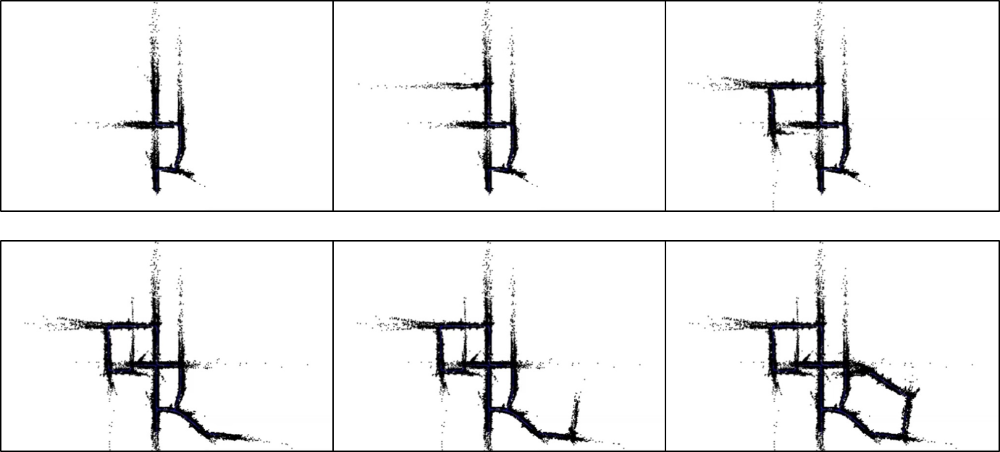 
    Fig1-2. RAFSet SLAM Results 

	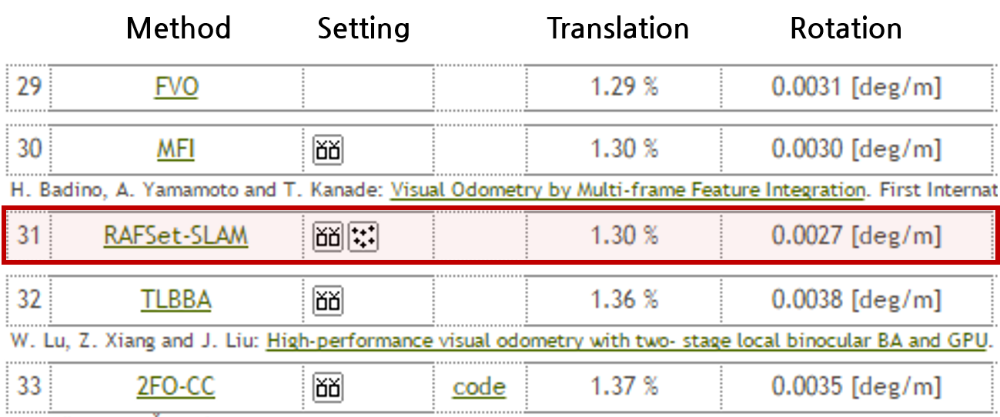 
    Fig1-3. KITTI Visual Odometry 부문 31위 (17.07.13) 

## GAN
**GAN(Generative Adversarial Networks)** : 대표적인 **비지도 학습(Unsupervised Learning)**중 하나로 **생성자(Generator)**와 **구별자(Discriminator)**의 **경쟁(Minimax problem)**을 통해 이미지를 생성한다. 

	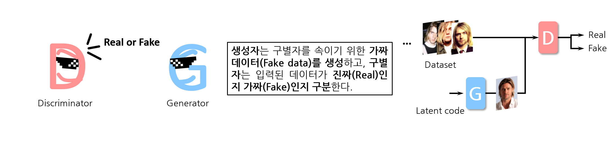 
    Fig2-1. Concept of GAN 

	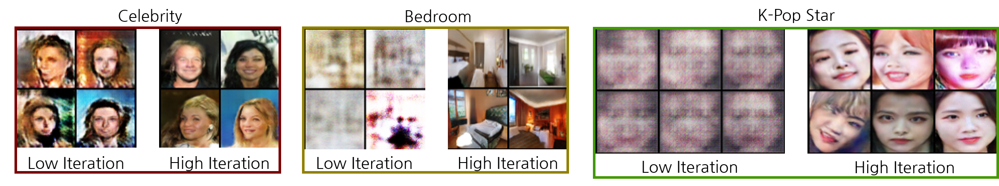 
    Fig2-2. GAN Results 

## De-Hazing  
**De-Hazing** : **안개나 해무, 옅은 구름** 등으로 인해 발생하는 **열화를 개선**하는 기법으로, **기존의 DCP(Dark Channel Prior)** 기반의 알고리즘의 경우 **짙은 안개에 취약**하다는 단점이 있다. 이러한 문제를 해결하기 위해 **HLS 컬러 공간 기반의 안개 제거 기법**을 제안하였다.

	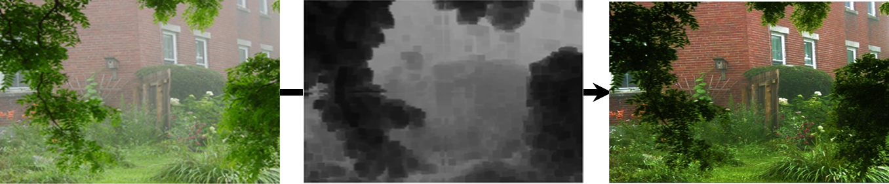 
    Fig3-1. Concept of De-Hazing 

	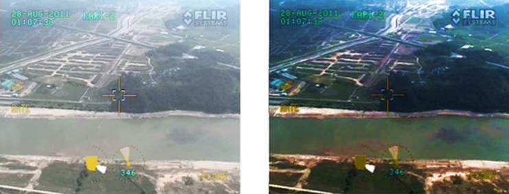 
    Fig3-2. HLS 컬러 기반의 안개 제거 성능 (입력, 출력)
 

## Intensity Enhancement (Retinex)
**Intensity Enhancement** : **역광현상**이나 **부족한 광원의 세기**로 인해 발생하는 **열화를 개선**하는 기법으로, 기존의 MSR의 경우 각 채널을 독립적으로 연산하여 원본의 색상 정보를 왜곡하고, 채도가 다소 떨어진다는 단점이 있다. 이러한 문제를 해결하기 위해 **MSRMS(MSR with Modified contrast and Saturation correction)**를 제안하였다.

	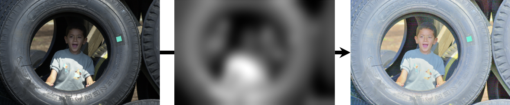 
    Fig4-1. Concept of MSR 

	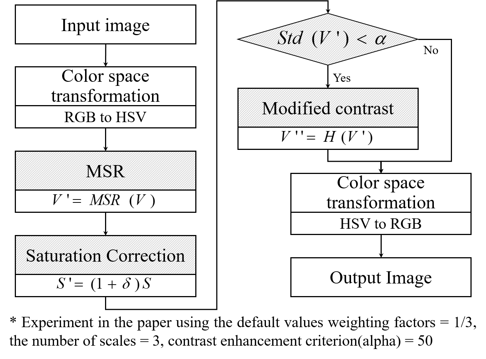 
    Fig4-2. Flow chart of MSRMS
 

	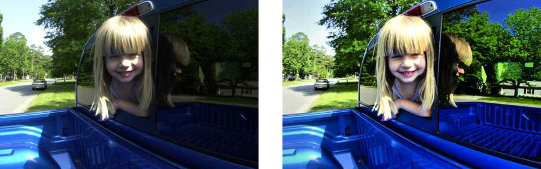 
    Fig4-2. MSRMS의 성능 (입력, 출력)
 

## Frame Rate Up Conversion (FRUC)
**FRUC(Frame Rate Up Conversion)** : 영상열에 일정한 주기로 **추가적인 프레임을 삽입** 하여 단위 시간당 **출력되는 프레임의 수를 증가** 시키는 기법이다. 기존의 방법은 움직임 추정 기법에 따라 단방향 움직임 추정(Unilateral Motion Estimation, UME)과 양방향 움직임 추정(Bilateral Motion Estimation, BME)으로 나뉜다. **UME**에서는 정확한 움직임 추정이 가능하나 **overlap과 hole**과 같은 문제점이 존재하고, **BME**에서는 overlap과 hole과 같은 문제는 없지만 **부정확한 움직임 추정으로 인한 화질 저하**가 발생한다. 이러한 문제를 해결하기 위해 **UME와 BME 기법을 동시에 사용하는 Hybrid Bilateral Motion Estimation** 방법을 제안하였다.

	 
    Fig5-1. Concept of FRUC 

	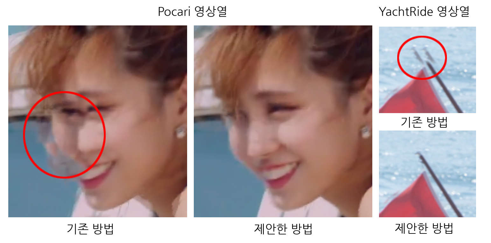 
    Fig5-2. 기존 방법과 제안한 방법 성능 비교(주관적 평가)
 

	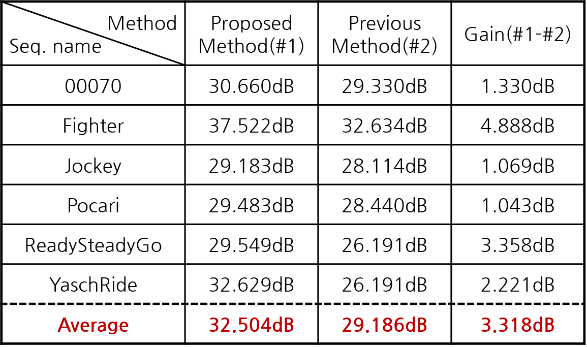 
    Fig5-3. 기존 방법과 제안한 방법 성능 비교(PSNR)
 

## 3D Reconstruction (Active Stereo Vision)
**Active Stereo Vision** : **두 대의 카메라**를 이용하여 깊이 정보를 획득하는 스테레오 비전 기법에 **추가적인 광원을 배치**하여 성능을 향상 시키는 방법이다.

	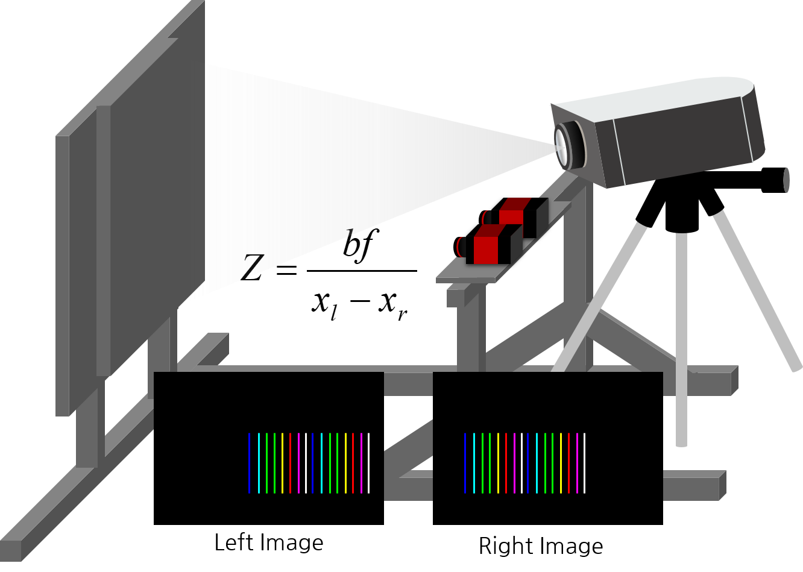 
    Fig6-1. Concept of Active Stereo Vision 

	 
    Fig6-2. Depth Map 예시 (입력, 깊이 맵)
 

	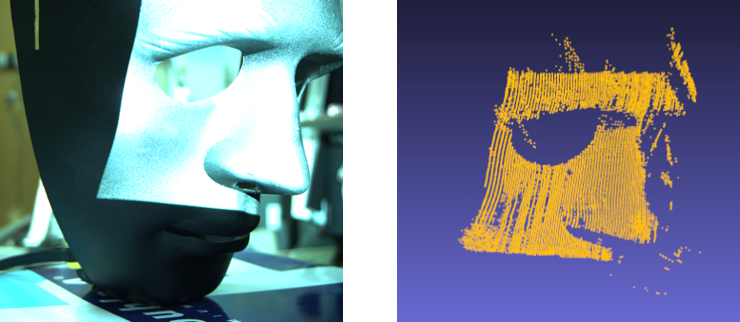 
    Fig6-3. 3D reconstruction results of mask (입력, 3차원 복원)
 

## 천장 지향 2D-LiDAR를 이용한 공간 정보 획득 및 위치 추정
**LiDAR(Light Detection and Ranging)** : **빛이 물체에 반사되어 돌아오는 시간**을 이용해 **거리를 측정**하는 센서이다. 2D-LiDAR를 회전하여 3차원 정보를 획득하고, **기존의 3D-LiDAR에 비해 높은 공간해상력을 획득하는 방법**을 제안한다. 

	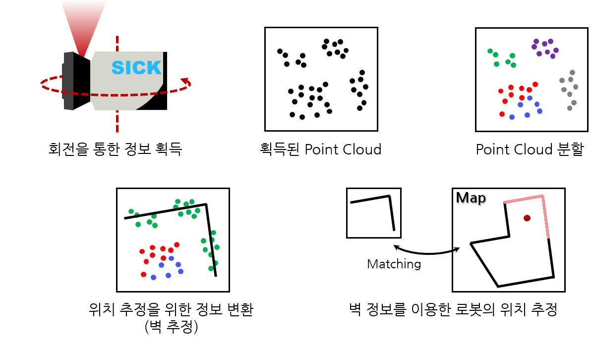 
    Fig7-1. 천장 지향 LiDAR 위치 추정 개념
 

	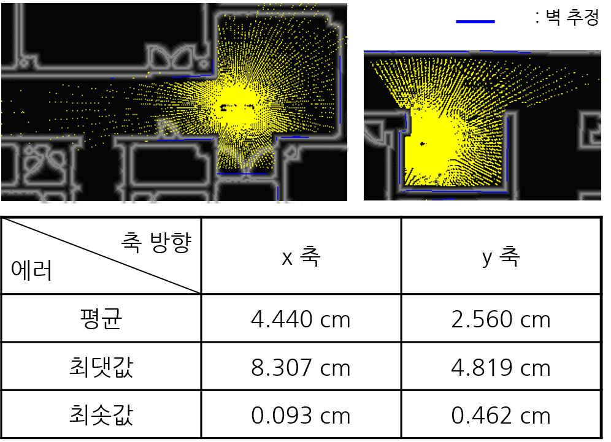 
    Fig7-2. 벽 추정 결과 및 위치 추정 에러
 

