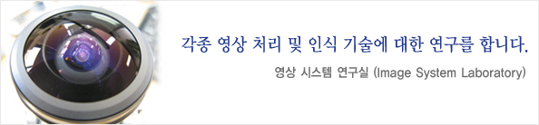
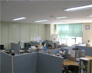
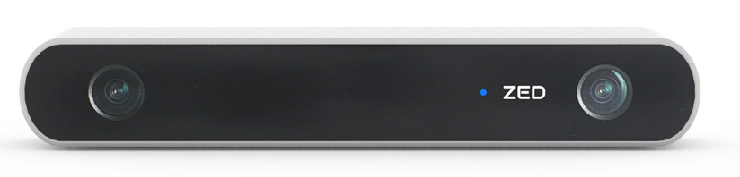
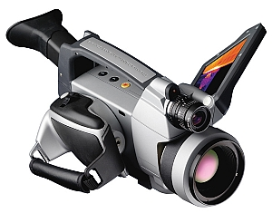
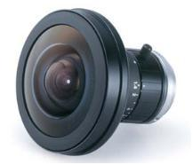

---
title:
date: 2018-09-12 20:46:20 Z
layout: article
modified: 2018-09-12 20:46:20 Z
excerpt: "ISL"
image:
  feature:
  teaser:
  thumb:
share: false
ads: false
---



## Introduction

영상 처리 및 인식에 필요한 요소 알고리즘들을 개발, 검증하고 이를 시스템화 하는 것을 목표로 한다. 주요 관심 응용 대상은 산업/국방용 영상 감시 시스템, 공장 자동화를 위한 비전 시스템, 다차원 영상을 이용한 검사 장비, 의료 영상 분석 시스템, 인간형 로봇을 위한 비전 시스템, 증강 현실 시스템 등이다. 이를 위해 영상을 분석 해석하기 위한 각종 영상 처리 및 인식 기술에 대한 연구 외에도 임베디드 시스템을 통한 구현 기술, 영상 전송을 위한 압축 기술(H.264, SVC), 영상 감시 시스템의 인증을 위한 워터마킹 기술들을 연구 한다.

## Lab Resource

<table class="tbTy11" border="1" cellspacing="0" bordercolor="#e8e8e8" cellpadding="0" width="606">
    <tbody>
        <tr>
            <td height="144" rowspan="4" width="182"></td>
            <td bgcolor="#ecefd6">
            
ㆍ주소

            </td>
            <td>
            
&nbsp;대전광역시 유성구 궁동 충남대학교 공대4호관 514호  
            &nbsp;영상시스템연구실

            </td>
        </tr>
        <tr>
            <td bgcolor="#ecefd6">
            
ㆍ전화

            </td>
            <td>
            
&nbsp;(042) 821 - 7787, 내선 : 7787

            </td>
        </tr>
        <tr>
            <td bgcolor="#ecefd6">
            
ㆍ팩스

            </td>
            <td>
            
&nbsp;(042) 823-4919

            </td>
        </tr>
        <tr>
            <td bgcolor="#ecefd6">
            
ㆍHomepage

            </td>
            <td>
            
&nbsp;http://isl.cnu.ac.kr

            </td>
        </tr>
    </tbody>
</table>

&nbsp;<!--컨텐츠끝//-->&nbsp;

<h3>보유 장비 목록</h3>

<h3>
<table style="border-width: 0.28pt; border-style: solid; border-color: rgb(0, 0, 0); border-collapse: collapse;">
    <tbody>
        <tr>
            <td valign="middle" colspan="2" style="border-width: 0.28pt; border-style: solid; border-color: rgb(236, 239, 214); width: 419.54pt; background: rgb(236, 239, 214); height: 2.82pt;">
            
ZED stereo camera<o:p></o:p>

            </td>
        </tr>
        <tr>
            <td valign="middle" style="border-width: 0.28pt; border-style: solid; border-color: rgb(236, 239, 214); width: 172.98pt; height: 2.82pt;">
            
&nbsp;

            </td>
            <td valign="middle" style="border-width: 0.28pt; border-style: solid; border-color: rgb(236, 239, 214); width: 246.56pt; height: 2.82pt;">
            
&middot; High-Resolution and High Frame-rate 3D Video Capture

            
&nbsp;

            
<o:p></o:p>

            
&middot; Depth Perception indoors and outdoors at up to 20m

            
&nbsp;

            
<o:p></o:p>

            
&middot; 6-DOF Positional Tracking

            
&nbsp;

            
<o:p></o:p>

            
&middot;Large-scale 3D Mapping using ZEDfu

            
<o:p></o:p>

            </td>
        </tr>
    </tbody>
</table>
</h3>
<h3><!--StartFragment-->

&nbsp;&nbsp;&nbsp;

<table style="border: 0.28pt solid rgb(0, 0, 0); border-collapse: collapse;">
    <tbody>
        <tr>
            <td valign="middle" colspan="2" style="border: 0.28pt solid rgb(236, 239, 214); width: 419.54pt; background: rgb(236, 239, 214); height: 2.82pt;">
            
NVIDIA Jetson TX1<o:p></o:p>

            </td>
        </tr>
        <tr>
            <td valign="middle" style="font-family: Arial, Verdana, sans-serif; font-size: 12px; border: 0.28pt solid rgb(236, 239, 214); width: 172.98pt; height: 2.82pt;">
            
&nbsp;

            </td>
            <td valign="middle" style="font-family: Arial, Verdana, sans-serif; font-size: 12px; border: 0.28pt solid rgb(236, 239, 214); width: 246.56pt; height: 2.82pt;">
            
&middot; NVIDIA의 HPC

            
&nbsp;

            
<o:p></o:p>

            
&middot; 1 TFLOP/s 256-core with NVIDIA Maxwell&trade; Architecture

            
&nbsp;

            
<o:p></o:p>

            
&middot; 64-bit ARM&reg; A57 CPUs

            
&nbsp;

            
<o:p></o:p>

            
&middot; 4 GB LPDDR4 | 25.6 GB/s

            
<o:p></o:p>

            </td>
        </tr>
    </tbody>
</table>

&nbsp;&nbsp;

</h3>
<h3>
<table style="border-width: 0.28pt; border-style: solid; border-color: rgb(0, 0, 0); border-collapse: collapse;">
    <tbody>
        <tr>
            <td valign="middle" colspan="2" style="border-width: 0.28pt; border-style: solid; border-color: rgb(236, 239, 214); width: 419.54pt; background: rgb(236, 239, 214); height: 2.82pt;">
            
NVIDIA Jetson TK1<o:p></o:p>

            </td>
        </tr>
        <tr>
            <td valign="middle" style="border-width: 0.28pt; border-style: solid; border-color: rgb(236, 239, 214); width: 172.98pt; height: 2.82pt;">
            
&nbsp;

            </td>
            <td valign="middle" style="border-width: 0.28pt; border-style: solid; border-color: rgb(236, 239, 214); width: 246.56pt; height: 2.82pt;">
            
&middot; NVIDIA의&nbsp;HPC

            
&nbsp;

            
<o:p></o:p>

            
&middot; NVIDIA Kepler GPU with 192 CUDA Cores

            
&nbsp;

            
<o:p></o:p>

            
&middot; NVIDIA 4-Plus-1&trade; Quad-Core ARM&reg; Cortex&trade;-A15 CPU

            
&nbsp;

            
<o:p></o:p>

            
&middot; 2 GB x16 Memory with 64-bit Width<o:p></o:p>

            </td>
        </tr>
    </tbody>
</table>

&nbsp;

</h3>

&nbsp;

<table style="border-bottom: #000000 0.28pt solid; border-left: #000000 0.28pt solid; border-collapse: collapse; border-top: #000000 0.28pt solid; border-right: #000000 0.28pt solid">
    <tbody>
        <tr>
            <td valign="middle" colspan="2" style="border-bottom: #ecefd6 0.28pt solid; border-left: #ecefd6 0.28pt solid; width: 419.54pt; background: #ecefd6; height: 2.82pt; border-top: #ecefd6 0.28pt solid; border-right: #ecefd6 0.28pt solid">
            
FLIR P620

            </td>
        </tr>
        <tr>
            <td valign="middle" style="border-bottom: #ecefd6 0.28pt solid; border-left: #ecefd6 0.28pt solid; width: 172.98pt; height: 2.82pt; border-top: #ecefd6 0.28pt solid; border-right: #ecefd6 0.28pt solid">
            
&nbsp;

            </td>
            <td valign="middle" style="border-bottom: #ecefd6 0.28pt solid; border-left: #ecefd6 0.28pt solid; width: 246.56pt; height: 2.82pt; border-top: #ecefd6 0.28pt solid; border-right: #ecefd6 0.28pt solid">
            
&middot; 열화상 카메라

            
&middot; 적외선을 이용하여 물체의 온도를 측정하는 장비

            </td>
        </tr>
    </tbody>
</table>
<!--StartFragment-->

&nbsp;

&nbsp;

&nbsp;

<table style="border-bottom: #000000 0.28pt solid; border-left: #000000 0.28pt solid; border-collapse: collapse; border-top: #000000 0.28pt solid; border-right: #000000 0.28pt solid">
    <tbody>
        <tr>
            <td valign="middle" colspan="2" style="border-bottom: #ecefd6 0.28pt solid; border-left: #ecefd6 0.28pt solid; width: 419.54pt; background: #ecefd6; height: 2.82pt; border-top: #ecefd6 0.28pt solid; border-right: #ecefd6 0.28pt solid">
            
Frame Grabber

            </td>
        </tr>
        <tr>
            <td valign="middle" style="border-bottom: #ecefd6 0.28pt solid; border-left: #ecefd6 0.28pt solid; width: 172.98pt; height: 2.82pt; border-top: #ecefd6 0.28pt solid; border-right: #ecefd6 0.28pt solid">
            
&nbsp;

            </td>
            <td valign="middle" style="border-bottom: #ecefd6 0.28pt solid; border-left: #ecefd6 0.28pt solid; width: 246.56pt; height: 2.82pt; border-top: #ecefd6 0.28pt solid; border-right: #ecefd6 0.28pt solid">
            
&middot; 아날로그 형태의 영상 신호를 컴퓨터에서 처리 가능한 디지털 신호로 변환해서 다른 장치로 출력하는 장치

            </td>
        </tr>
    </tbody>
</table>
<!--StartFragment-->

&nbsp;

&nbsp;

<!--StartFragment-->

&nbsp;

<table style="border-bottom: #000000 0.28pt solid; border-left: #000000 0.28pt solid; border-collapse: collapse; border-top: #000000 0.28pt solid; border-right: #000000 0.28pt solid">
    <tbody>
        <tr>
            <td valign="middle" colspan="2" style="border-bottom: #ecefd6 0.28pt solid; border-left: #ecefd6 0.28pt solid; width: 419.54pt; background: #ecefd6; height: 2.82pt; border-top: #ecefd6 0.28pt solid; border-right: #ecefd6 0.28pt solid">
            
Dragonfly 2

            </td>
        </tr>
        <tr>
            <td valign="middle" style="border-bottom: #ecefd6 0.28pt solid; border-left: #ecefd6 0.28pt solid; width: 172.98pt; height: 2.82pt; border-top: #ecefd6 0.28pt solid; border-right: #ecefd6 0.28pt solid">
            
<v:shapetype id="_x0000_t75" stroked="f" filled="f" path="m@4@5l@4@11@9@11@9@5xe" o:preferrelative="t" o:spt="75" coordsize="21600,21600"><v:stroke joinstyle="miter"></v:stroke><v:formulas><v:f eqn="if lineDrawn pixelLineWidth 0"></v:f><v:f eqn="sum @0 1 0"></v:f><v:f eqn="sum 0 0 @1"></v:f><v:f eqn="prod @2 1 2"></v:f><v:f eqn="prod @3 21600 pixelWidth"></v:f><v:f eqn="prod @3 21600 pixelHeight"></v:f><v:f eqn="sum @0 0 1"></v:f><v:f eqn="prod @6 1 2"></v:f><v:f eqn="prod @7 21600 pixelWidth"></v:f><v:f eqn="sum @8 21600 0"></v:f><v:f eqn="prod @7 21600 pixelHeight"></v:f><v:f eqn="sum @10 21600 0"></v:f></v:formulas><v:path o:connecttype="rect" gradientshapeok="t" o:extrusionok="f"></v:path><o:lock aspectratio="t" v:ext="edit"></o:lock></v:shapetype>

            </td>
            <td valign="middle" style="border-bottom: #ecefd6 0.28pt solid; border-left: #ecefd6 0.28pt solid; width: 246.56pt; height: 2.82pt; border-top: #ecefd6 0.28pt solid; border-right: #ecefd6 0.28pt solid">
            
&middot; ITS(차량 번호 인식)

            
&middot; Robot Vision

            
&middot; 얼굴 인식 등의 보안 및 일반 영상 검사 분야

            </td>
        </tr>
    </tbody>
</table>

&nbsp;

&nbsp;

<!--StartFragment--><!--StartFragment-->

&nbsp;

<table style="border-bottom: #000000 0.28pt solid; border-left: #000000 0.28pt solid; border-collapse: collapse; border-top: #000000 0.28pt solid; border-right: #000000 0.28pt solid">
    <tbody>
        <tr>
            <td valign="middle" colspan="2" style="border-bottom: #ecefd6 0.28pt solid; border-left: #ecefd6 0.28pt solid; width: 419.54pt; background: #ecefd6; height: 2.82pt; border-top: #ecefd6 0.28pt solid; border-right: #ecefd6 0.28pt solid">
            
Flea 2

            </td>
        </tr>
        <tr>
            <td valign="middle" style="border-bottom: #ecefd6 0.28pt solid; border-left: #ecefd6 0.28pt solid; width: 172.98pt; height: 2.82pt; border-top: #ecefd6 0.28pt solid; border-right: #ecefd6 0.28pt solid">
            
<v:shapetype id="_x0000_t75" stroked="f" filled="f" path="m@4@5l@4@11@9@11@9@5xe" o:preferrelative="t" o:spt="75" coordsize="21600,21600"><v:stroke joinstyle="miter"></v:stroke><v:formulas><v:f eqn="if lineDrawn pixelLineWidth 0"></v:f><v:f eqn="sum @0 1 0"></v:f><v:f eqn="sum 0 0 @1"></v:f><v:f eqn="prod @2 1 2"></v:f><v:f eqn="prod @3 21600 pixelWidth"></v:f><v:f eqn="prod @3 21600 pixelHeight"></v:f><v:f eqn="sum @0 0 1"></v:f><v:f eqn="prod @6 1 2"></v:f><v:f eqn="prod @7 21600 pixelWidth"></v:f><v:f eqn="sum @8 21600 0"></v:f><v:f eqn="prod @7 21600 pixelHeight"></v:f><v:f eqn="sum @10 21600 0"></v:f></v:formulas><v:path o:connecttype="rect" gradientshapeok="t" o:extrusionok="f"></v:path><o:lock aspectratio="t" v:ext="edit"></o:lock></v:shapetype>

            </td>
            <td valign="middle" style="border-bottom: #ecefd6 0.28pt solid; border-left: #ecefd6 0.28pt solid; width: 246.56pt; height: 2.82pt; border-top: #ecefd6 0.28pt solid; border-right: #ecefd6 0.28pt solid">
            
&middot; 반도체, 디스플레이 관련 검사

            
&middot; ITS(차량 번호 인식)

            
&middot; 보안 솔루션 및 일반 영상 분야

            </td>
        </tr>
    </tbody>
</table>

&nbsp;

&nbsp;

<!--StartFragment--><!--StartFragment-->

&nbsp;

<table style="border-bottom: #000000 0.28pt solid; border-left: #000000 0.28pt solid; border-collapse: collapse; border-top: #000000 0.28pt solid; border-right: #000000 0.28pt solid">
    <tbody>
        <tr>
            <td valign="middle" colspan="2" style="border-bottom: #ecefd6 0.28pt solid; border-left: #ecefd6 0.28pt solid; width: 419.54pt; background: #ecefd6; height: 2.82pt; border-top: #ecefd6 0.28pt solid; border-right: #ecefd6 0.28pt solid">
            
Bumblebee2

            </td>
        </tr>
        <tr>
            <td valign="middle" style="border-bottom: #ecefd6 0.28pt solid; border-left: #ecefd6 0.28pt solid; width: 172.98pt; height: 2.82pt; border-top: #ecefd6 0.28pt solid; border-right: #ecefd6 0.28pt solid">
            
<v:shapetype id="_x0000_t75" stroked="f" filled="f" path="m@4@5l@4@11@9@11@9@5xe" o:preferrelative="t" o:spt="75" coordsize="21600,21600"><v:stroke joinstyle="miter"></v:stroke><v:formulas><v:f eqn="if lineDrawn pixelLineWidth 0"></v:f><v:f eqn="sum @0 1 0"></v:f><v:f eqn="sum 0 0 @1"></v:f><v:f eqn="prod @2 1 2"></v:f><v:f eqn="prod @3 21600 pixelWidth"></v:f><v:f eqn="prod @3 21600 pixelHeight"></v:f><v:f eqn="sum @0 0 1"></v:f><v:f eqn="prod @6 1 2"></v:f><v:f eqn="prod @7 21600 pixelWidth"></v:f><v:f eqn="sum @8 21600 0"></v:f><v:f eqn="prod @7 21600 pixelHeight"></v:f><v:f eqn="sum @10 21600 0"></v:f></v:formulas><v:path o:connecttype="rect" gradientshapeok="t" o:extrusionok="f"></v:path><o:lock aspectratio="t" v:ext="edit"></o:lock></v:shapetype>

            </td>
            <td valign="middle" style="border-bottom: #ecefd6 0.28pt solid; border-left: #ecefd6 0.28pt solid; width: 246.56pt; height: 2.82pt; border-top: #ecefd6 0.28pt solid; border-right: #ecefd6 0.28pt solid">
            
&middot; 스테레어 비젼 카메라

            
&middot; 사용자를 3D 데이터를 제공

            
&middot; 거리측정을 위한 장비

            </td>
        </tr>
    </tbody>
</table>
<!--StartFragment-->

&nbsp;

&nbsp;

<!--StartFragment-->

&nbsp;

<table style="border-bottom: #000000 0.28pt solid; border-left: #000000 0.28pt solid; border-collapse: collapse; border-top: #000000 0.28pt solid; border-right: #000000 0.28pt solid">
    <tbody>
        <tr>
            <td valign="middle" colspan="2" style="border-bottom: #ecefd6 0.28pt solid; border-left: #ecefd6 0.28pt solid; width: 419.54pt; background: #ecefd6; height: 2.82pt; border-top: #ecefd6 0.28pt solid; border-right: #ecefd6 0.28pt solid">
            
FE185C046HA-1

            </td>
        </tr>
        <tr>
            <td valign="middle" style="border-bottom: #ecefd6 0.28pt solid; border-left: #ecefd6 0.28pt solid; width: 172.98pt; height: 2.82pt; border-top: #ecefd6 0.28pt solid; border-right: #ecefd6 0.28pt solid">
            
<v:shapetype id="_x0000_t75" stroked="f" filled="f" path="m@4@5l@4@11@9@11@9@5xe" o:preferrelative="t" o:spt="75" coordsize="21600,21600"><v:stroke joinstyle="miter"></v:stroke><v:formulas><v:f eqn="if lineDrawn pixelLineWidth 0"></v:f><v:f eqn="sum @0 1 0"></v:f><v:f eqn="sum 0 0 @1"></v:f><v:f eqn="prod @2 1 2"></v:f><v:f eqn="prod @3 21600 pixelWidth"></v:f><v:f eqn="prod @3 21600 pixelHeight"></v:f><v:f eqn="sum @0 0 1"></v:f><v:f eqn="prod @6 1 2"></v:f><v:f eqn="prod @7 21600 pixelWidth"></v:f><v:f eqn="sum @8 21600 0"></v:f><v:f eqn="prod @7 21600 pixelHeight"></v:f><v:f eqn="sum @10 21600 0"></v:f></v:formulas><v:path o:connecttype="rect" gradientshapeok="t" o:extrusionok="f"></v:path><o:lock aspectratio="t" v:ext="edit"></o:lock></v:shapetype>

            </td>
            <td valign="middle" style="border-bottom: #ecefd6 0.28pt solid; border-left: #ecefd6 0.28pt solid; width: 246.56pt; height: 2.82pt; border-top: #ecefd6 0.28pt solid; border-right: #ecefd6 0.28pt solid">
            
&middot; 어안렌즈

            
&middot; 시야각 185&deg;를 지원하는 렌즈

            
&middot; 최대 5 megapixel의 카메라까지 지원

            </td>
        </tr>
    </tbody>
</table>

