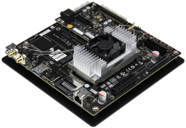
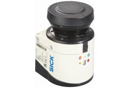
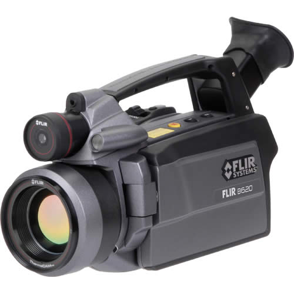

---
title:
date: 2018-09-12 20:46:20 Z
layout: article
modified: 2018-09-12 20:46:20 Z
excerpt: "ISL"
image:
  feature:
  teaser:
  thumb:
share: false
ads: false
---



## Introduction

영상 처리 및 인식에 필요한 요소 알고리즘들을 개발, 검증하고 이를 시스템화 하는 것을 목표로 한다. 주요 관심 응용 대상은 산업/국방용 영상 감시 시스템, 공장 자동화를 위한 비전 시스템, 다차원 영상을 이용한 검사 장비, 의료 영상 분석 시스템, 인간형 로봇을 위한 비전 시스템, 증강 현실 시스템 등이다. 이를 위해 영상을 분석 해석하기 위한 각종 영상 처리 및 인식 기술에 대한 연구 외에도 임베디드 시스템을 통한 구현 기술, 영상 전송을 위한 압축 기술(H.264, SVC), 영상 감시 시스템의 인증을 위한 워터마킹 기술들을 연구 한다.

## Camera list
### ZED Stereo Camera 

* High-Resolution and High Frame-rate 3D Video Captur
* Depth Perception indoors and outdoors at up to 20m
* 6-DOF Positional Tracking
* Large-scale 3D Mapping using ZEDfu

### NVIDIA Jetson TX1

 
* NVIDIA HPC
* 1 TFLOP/s 256-core with NVIDIA Maxwell™ Architecture
* 64-bit ARM® A57 CPUs
* 4 GB LPDDR4 | 25.6 GB/s

### NVIDIA Jetson TK1

* NVIDIA HPC
* NVIDIA Kepler GPU with 192 CUDA Cores
* NVIDIA 4-Plus-1™ Quad-Core ARM® Cortex™-A15 CPU
* 2 GB x16 Memory with 64-bit Width

### SICK LMS111

* SICK LiDAR
* Range (m) : 0.5 – 20 (18 with reflectivity below 10%)
* Field of View (degrees) : 270
* Angular Resolution (degrees) : 0.25, 0.5

  
### FLIR P620

 
* 열화상 카메라
* 적외선을 이용하여 물체의 온도를 측정하는 장비

### Frame Grabber

 
* 아날로그 형태의 영상 신호를 컴퓨터에서 처리 가능한 디지털 신호로 변환하는 장치

### Dragofly 2

* ITS(차량 번호 인식)
* Robot Vision
* 얼굴 인식 등의 보안 및 일반 영상 검사 분야

### Flea 2

 
* 반도체, 디스플레이 관련 검사
* ITS(차량 번호 인식)
* 보안 솔루션 및 일반 영상 분야

### Bumblebee2

* 스테레오 비전 카메라
* 3차원 데이터 제공