## Professor
<!-- <table class="tbTy11" bordercolor="#FFFFFF" cellspacing="0" cellpadding="0" border="0">
    <tbody>
        <tr>
            <td height="150" rowspan="4" width="100"></td>
            <td rowspan="4">
            
<strong>Prof. Yun-Ho Ko</strong> 

            </td>
        </tr>
    </tbody>
</table> -->

 
<strong>Prof. Yun-Ho Ko</strong>
Office: 충남대학교 공대 4호관 527호 
Tel: +82-42-821-6860 
E-mail: koy@cnu.ac.kr

* **EDUCATION**  
  Ph.D. Department of Electrical Engineering & Computer Science, KAIST, Daejeon, 2002.  
  M.S. Department of Electrical Engineering & Computer Science, KAIST, Daejeon, 1997.  
  B.S. Department of Electrical Engineering, Pusan National University, 1995.

* **EXPERIENCE**  
  Senior Engineer, MCU Application Design Team, Hynix Semiconductor Inc. 2002. 9 ~ 2004. 9.

* **RESEARCH INTEREST**  
  Computer vision  
  Image compression  
  Pattern recognition  
  Augmented Reality  
  Watermarking  

<!-- |     |     |     |
|-----|-----|-----|
|

 | 
**Name**
 | 
**Ko, Yun-Ho**
 | -->

## Ph.D Candidates

|     |     |     |     |
|-----|-----|-----|-----|
|
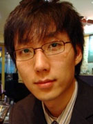
 | 
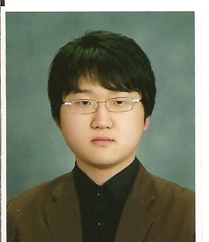
 | 

 | 

|
|
<strong>김진형</strong>
 | 
<strong>김태원</strong>
 | 
<strong>유용길</strong>
 | 
<strong>강재웅</strong>
|
|
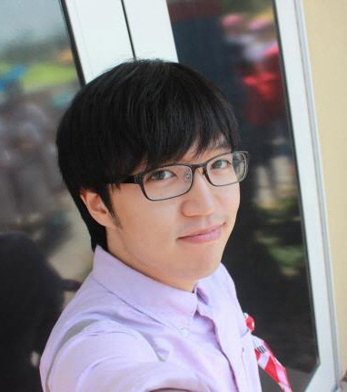
 | 
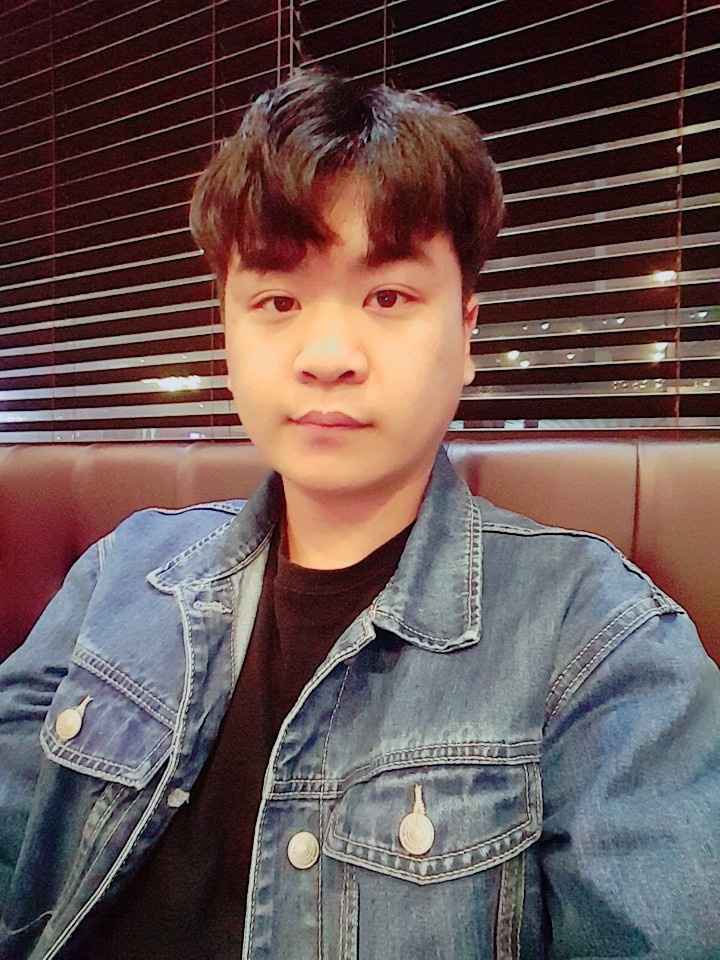
 | 

 | |
|
<strong>안재원</strong>
 | 
<strong>강한솔</strong> 
 | 
<strong>김미정</strong>
 |     |

## M.S Candidates

|     |     |     |     |
|-----|-----|-----|-----|
|

 | 

 | 

 | |
|
<strong>현재복</strong>
 | 
<strong>정구표</strong>
 | 
<strong>김근태</strong>
 |
       
 |

## Undergraduates

|     |     |     |     |
|-----|-----|-----|-----|
|

 | 

 | 

 | |
|
<strong>김현종</strong>
 | 
<strong>박규하</strong>
 | 
<strong>송재열</strong>
 |     |

## Alumni

|     |     |     |     |
|-----|-----|-----|-----|
|

 | 

 | 
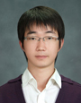
 | 
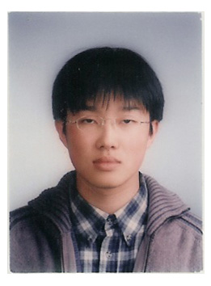
|
|
<strong>성종모(ETRI)</strong>
 | 
<strong>맹형열(LG전자)</strong>
 | 
<strong>정윤호(Silicon Works)</strong>
 | 
<strong>이태영(Coxem)</strong>
|
|

 | 
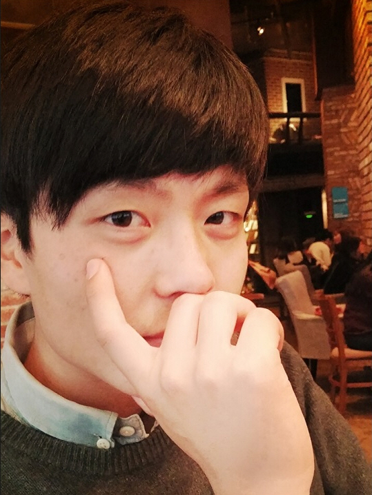
 | 
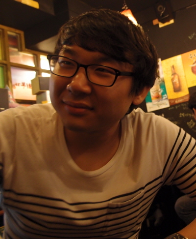
 | 
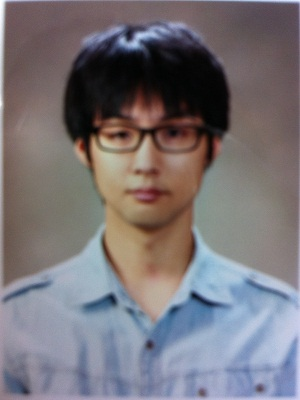
|
|
<strong>김동진(롯데정보통신)</strong>
 | 
<strong>김진욱(한화시스템즈)</strong>
 | 
<strong>정유철(쎄트렉아이)</strong>
 | 
<strong>안병민(Coxem)</strong>
|
|

 | 

 | 
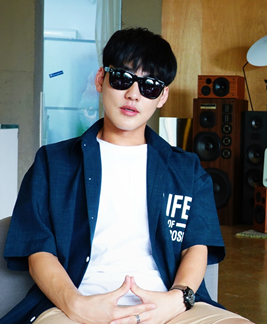
 | 
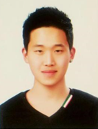
|
|
<strong>이정우(두산중공업)</strong>
 | 
<strong>최성민(KARI)</strong>
 | 
<strong>박태훈(KIST)</strong>
 | 
<strong>박가용(BurnYoung)</strong>
|
|
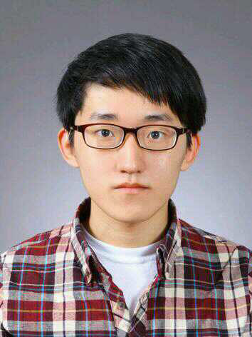
 | 
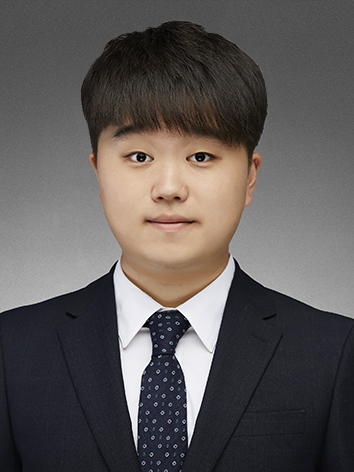
 |  | |

<strong>한병인(-)</strong>
 | 
<strong>전현호(ADD)</strong>
 |  | |